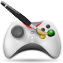

# Awesome Godot & GDScript 

> Last Update : 07.05.2020

## Description 

<table width="100%">
    <tr>
        <td align="center" valign="center" width="85">
            
        </td>
        <td>
        Although our list is basically built on <b>Godot Engine</b>, we have listed this list not only with the Godot Engine, but by combining the assets, scripts, animations, graphics, fonts, physics accounts and more we need for a game development. You can find both tips and tactics that you may need during the development as well as helping beginners. At the same time, we have gathered important and prominent discussion topics in godot forums or similar communities, high probability of encountering and resolved problems for you here.
        </td>
    </tr>
    <tr>
        <td align="center" valign="center">
            
        </td>
        <td>
        Listemiz temel olarak <b>Godot Engine</b> üzerine yapılmış olsa da, bu listeyi sadece Godot Engine ile sınırlı tutmayıp bir oyun geliştirme için ihtiyacımız olan assetleri, scriptleri, animasyonları, grafikleri, fontları, fizik hesaplarını ve daha fazlasını bir araya getirerek listeledik. Hem yeni başlayanlara yardımcı, hem de geliştirme sırasında ihtiyac duyabileceğiniz bazı ipuclarını, taktikleri bulabilirsiniz. Aynı zamanda godot forumları yada benzer topluluklarda yer alan önem kazanmış, öne çıkmış tartışma konuları, denk gelme olasılığınız yüksek ve çözülmüş sorunları başlıklar halinde burada sizin için topladık.
        </td>
    </tr>
    <tr>
        <td align="center" valign="center">
            
        </td>
        <td>..</td>
    </tr>
</table>

> You can see the contributors below.

## Categories 

<table width="100%">
    <tr>
        <td align="center" valign="top">
            <a href="tutorials.md" title="godot youtube tutorials">
                
                 
                <b>Youtube Tutorials</b>
            </a>
             
            In this list, there is a list of video lessons that consist of more than one lesson selected on specific topics. It answers questions such as <b>How To?</b>, <b>How can we use?</b>, <b>How can we do?</b>.
        </td>
        <td align="center" valign="top">
            <a href="games.md" title="godot game demos example">
                
                 
                <b>Game Demos / Examples</b>
            </a>
             
            We have listed the game demos and examples that we have discovered from the entire open source community, which will show you examples and answer some questions in your mind. You can see the codes of <b>2d</b> and <b>3d</b> games from almost any category here.
        </td>
        <td align="center" valign="top">
            <a href="assets.md" title="free game assets">
                
                 
                <b>Assets</b>
            </a>
             
            Graphics, characters, maps, drawings, sounds etc., which are indispensable for the game world. You can find the places where you can use or buy the contents for free in a list.
        </td>
    </tr>
    <tr>
        <td align="center" valign="top">
            <a href="animations.md" title="godot animation">
                
                 
                <b>Animation</b>
            </a>
             
            With the animation tool included in Godot Editor, you can see what you can do, how to use it, ready-made examples, video narratives in the list here.
        </td>
        <td align="center" valign="top">
            <a href="fonts.md" title="fonts">
                
                 
                <b>Fonts</b>
            </a>
             
            Links to find fonts that you can use in the content of your games are listed here.
        </td>
        <td align="center" valign="top">
            <a href="physics.md" title="godot physics">
                
                 
                <b>Physics</b>
            </a>
             
            You can find the examples of physics that create the dynamics of our games, and that we will make our characters or vehicles in the game move just like in the real world.
        </td>
    </tr>
    <tr>
        <td align="center" valign="top">
            <a href="plugins.md" title="godot plugins">
                
                 
                <b>Plugins / Modules</b>
            </a>
             
            You can see the ready-made packages and add-ons you need during game development in this list.
        </td>
        <td align="center" valign="top">
            <a href="codes.md" title="GDScript / Tips and Tricks">
                
                 
                <b>GDScript / Tips and Tricks</b>
            </a>
             
            Here is a list of links that will help you learn and use <b> GDScript </b> to help you with Godot Engine
        </td>
        <td align="center" valign="top">
            <a href="forums.md" title="Godot Forum / Community Important Titles">
                
                 
                <b>Forum / Community Important Titles</b>
            </a>
             
            You can find a list of forums, twitter, developer groups, discussion topics that you can stay in touch with about the community. You will have instant news of the latest developments.
        </td>
    </tr>
</table>

## Contributors 
<table>
    <tr>
        <td align="center">
            <a href="https://github.com/hto">
                
             
            <b>Halil Tuğcan Özaktaş</b>
        </a>
        </td>
    </tr>
</table>
